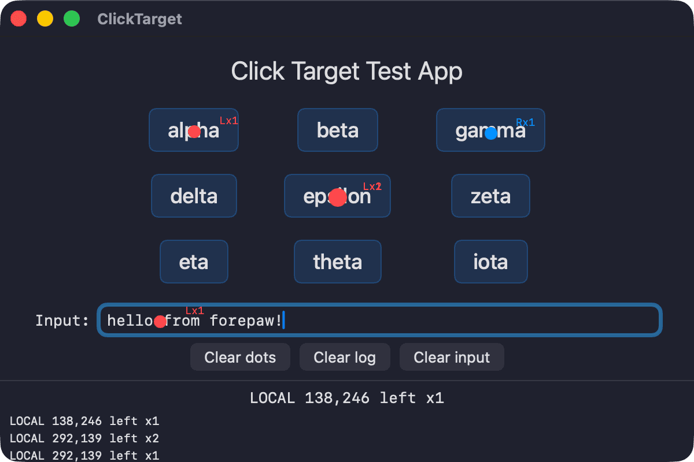

# ClickTarget

Test app for verifying forepaw's click accuracy, coordinate mapping, and input simulation.



## What it tests

- **OCR click accuracy**: 3x3 grid of labeled words to click by name
- **Right-click**: blue dots (Rx1)
- **Double-click**: larger dots (Lx2)
- **Text input**: text field for `keyboard-type` and `type` testing
- **Click logging**: every click shows coordinates and type in the log area

## Visual feedback

Clicks show colored dots at the exact landing position:
- **Red** = left click, **Blue** = right click
- **Small** = single, **Medium** = double, **Large** = triple
- Labels show `Lx1` (left x1), `Rx1` (right x1), `Lx2` (left x2), etc.

## Running

```bash
cd TestApps/ClickTarget
swift build
cp .build/debug/ClickTarget .build/ClickTarget.app/Contents/MacOS/ClickTarget
open .build/ClickTarget.app
```

The `.app` bundle wrapper is needed -- unbundled CLI processes can't be activated by `NSRunningApplication.activate()`, so forepaw's `--app` flag won't work without it.

## Example test session

```bash
forepaw ocr-click "epsilon" --app ClickTarget          # left click
forepaw ocr-click "gamma" --app ClickTarget --right    # right click
forepaw ocr-click "theta" --app ClickTarget --double   # double click
forepaw ocr-click "Type here" --app ClickTarget        # focus text field
forepaw keyboard-type "hello" --app ClickTarget         # type text
forepaw snapshot --app ClickTarget -i                   # check AX tree
```
